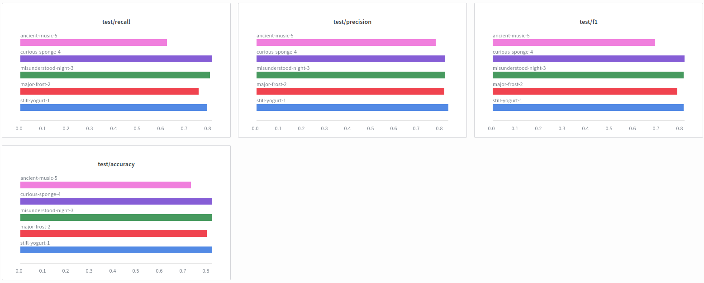
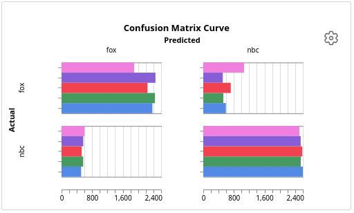
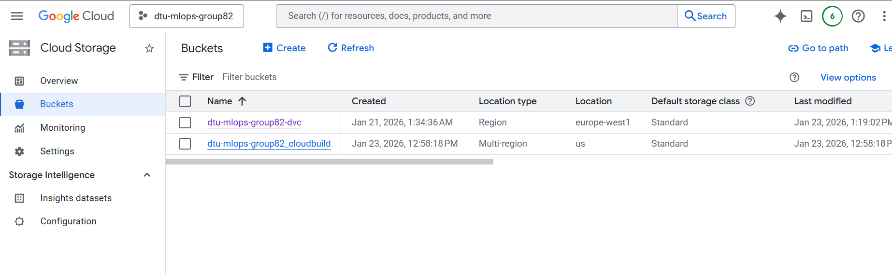
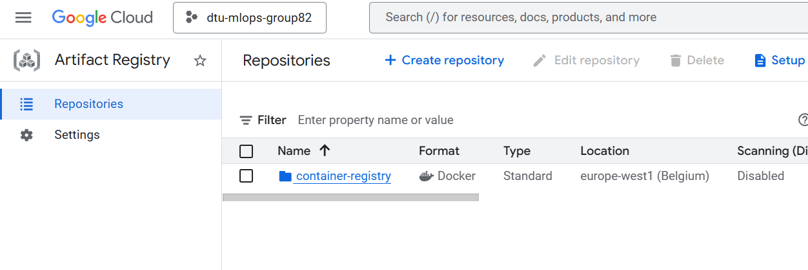
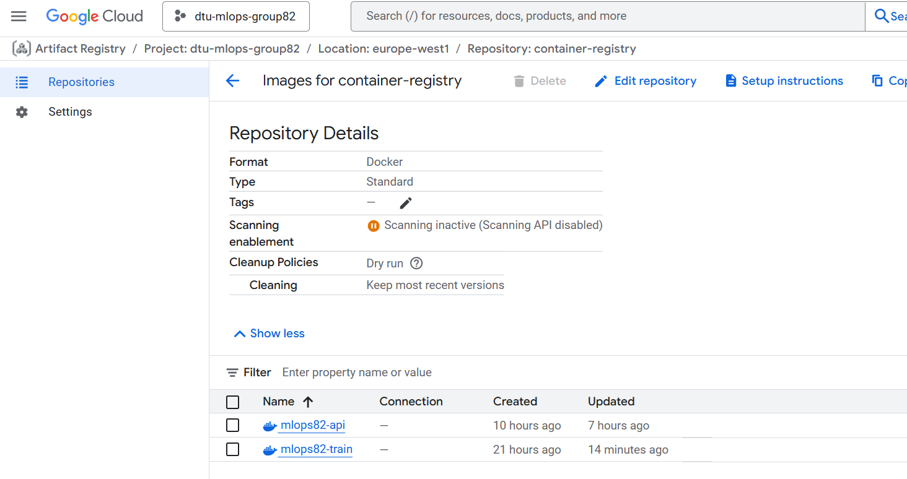
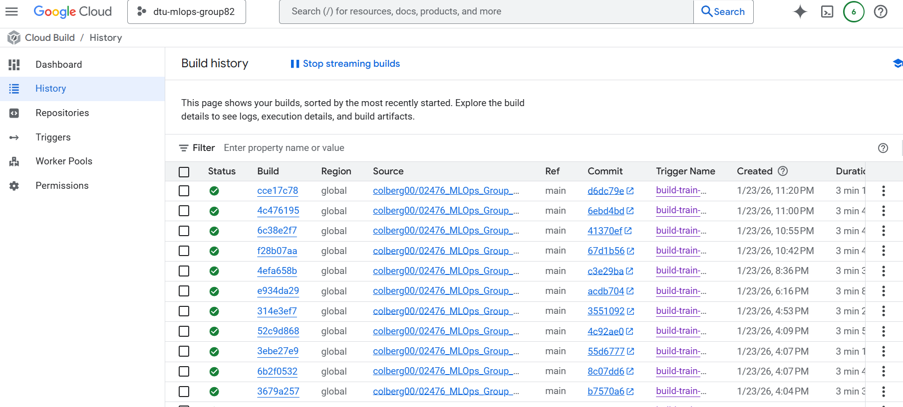

# Exam template for 02476 Machine Learning Operations

This is the report template for the exam. Please only remove the text formatted as with three dashes in front and behind
like:

```--- question 1 fill here ---```

Where you instead should add your answers. Any other changes may have unwanted consequences when your report is
auto-generated at the end of the course. For questions where you are asked to include images, start by adding the image
to the `figures` subfolder (please only use `.png`, `.jpg` or `.jpeg`) and then add the following code in your answer:

``

In addition to this markdown file, we also provide the `report.py` script that provides two utility functions:

Running:

```bash
python report.py html
```

Will generate a `.html` page of your report. After the deadline for answering this template, we will auto-scrape
everything in this `reports` folder and then use this utility to generate a `.html` page that will be your serve
as your final hand-in.

Running

```bash
python report.py check
```

Will check your answers in this template against the constraints listed for each question e.g. is your answer too
short, too long, or have you included an image when asked. For both functions to work you mustn't rename anything.
The script has two dependencies that can be installed with

```bash
pip install typer markdown
```

or

```bash
uv add typer markdown
```

## Overall project checklist

The checklist is *exhaustive* which means that it includes everything that you could do on the project included in the
curriculum in this course. Therefore, we do not expect at all that you have checked all boxes at the end of the project.
The parenthesis at the end indicates what module the bullet point is related to. Please be honest in your answers, we
will check the repositories and the code to verify your answers.

### Week 1

* [ ] Create a git repository (M5)
* [ ] Make sure that all team members have write access to the GitHub repository (M5)
* [ ] Create a dedicated environment for you project to keep track of your packages (M2)
* [ ] Create the initial file structure using cookiecutter with an appropriate template (M6)
* [ ] Fill out the `data.py` file such that it downloads whatever data you need and preprocesses it (if necessary) (M6)
* [ ] Add a model to `model.py` and a training procedure to `train.py` and get that running (M6)
* [ ] Remember to either fill out the `requirements.txt`/`requirements_dev.txt` files or keeping your
    `pyproject.toml`/`uv.lock` up-to-date with whatever dependencies that you are using (M2+M6)
* [ ] Remember to comply with good coding practices (`pep8`) while doing the project (M7)
* [ ] Do a bit of code typing and remember to document essential parts of your code (M7)
* [ ] Setup version control for your data or part of your data (M8)
* [ ] Add command line interfaces and project commands to your code where it makes sense (M9)
* [ ] Construct one or multiple docker files for your code (M10)
* [ ] Build the docker files locally and make sure they work as intended (M10)
* [ ] Write one or multiple configurations files for your experiments (M11)
* [ ] Used Hydra to load the configurations and manage your hyperparameters (M11)
* [ ] Use profiling to optimize your code (M12)
* [ ] Use logging to log important events in your code (M14)
* [ ] Use Weights & Biases to log training progress and other important metrics/artifacts in your code (M14)
* [ ] Consider running a hyperparameter optimization sweep (M14)
* [ ] Use PyTorch-lightning (if applicable) to reduce the amount of boilerplate in your code (M15)

### Week 2

* [ ] Write unit tests related to the data part of your code (M16)
* [ ] Write unit tests related to model construction and or model training (M16)
* [ ] Calculate the code coverage (M16)
* [ ] Get some continuous integration running on the GitHub repository (M17)
* [ ] Add caching and multi-os/python/pytorch testing to your continuous integration (M17)
* [ ] Add a linting step to your continuous integration (M17)
* [ ] Add pre-commit hooks to your version control setup (M18)
* [ ] Add a continues workflow that triggers when data changes (M19)
* [ ] Add a continues workflow that triggers when changes to the model registry is made (M19)
* [ ] Create a data storage in GCP Bucket for your data and link this with your data version control setup (M21)
* [ ] Create a trigger workflow for automatically building your docker images (M21)
* [ ] Get your model training in GCP using either the Engine or Vertex AI (M21)
* [ ] Create a FastAPI application that can do inference using your model (M22)
* [ ] Deploy your model in GCP using either Functions or Run as the backend (M23)
* [ ] Write API tests for your application and setup continues integration for these (M24)
* [ ] Load test your application (M24)
* [ ] Create a more specialized ML-deployment API using either ONNX or BentoML, or both (M25)
* [ ] Create a frontend for your API (M26)

### Week 3

* [ ] Check how robust your model is towards data drifting (M27)
* [ ] Setup collection of input-output data from your deployed application (M27)
* [ ] Deploy to the cloud a drift detection API (M27)
* [ ] Instrument your API with a couple of system metrics (M28)
* [ ] Setup cloud monitoring of your instrumented application (M28)
* [ ] Create one or more alert systems in GCP to alert you if your app is not behaving correctly (M28)
* [ ] If applicable, optimize the performance of your data loading using distributed data loading (M29)
* [ ] If applicable, optimize the performance of your training pipeline by using distributed training (M30)
* [ ] Play around with quantization, compilation and pruning for you trained models to increase inference speed (M31)

### Extra

* [ ] Write some documentation for your application (M32)
* [ ] Publish the documentation to GitHub Pages (M32)
* [ ] Revisit your initial project description. Did the project turn out as you wanted?
* [ ] Create an architectural diagram over your MLOps pipeline
* [ ] Make sure all group members have an understanding about all parts of the project
* [ ] Uploaded all your code to GitHub

## Group information

### Question 1
> **Enter the group number you signed up on <learn.inside.dtu.dk>**
>
> Answer:

82

### Question 2
> **Enter the study number for each member in the group**
>
> Example:
>
> *sXXXXXX, sXXXXXX, sXXXXXX*
>
> Answer:

s224345,s224343

### Question 3
> **Did you end up using any open-source frameworks/packages not covered in the course during your project? If so**
> **which did you use and how did they help you complete the project?**
>
> Recommended answer length: 0-200 words.
>
> Example:
> *We used the third-party framework ... in our project. We used functionality ... and functionality ... from the*
> *package to do ... and ... in our project*.
>
> Answer:

--- question 3 fill here ---

## Coding environment

> In the following section we are interested in learning more about you local development environment. This includes
> how you managed dependencies, the structure of your code and how you managed code quality.

### Question 4

> **Explain how you managed dependencies in your project? Explain the process a new team member would have to go**
> **through to get an exact copy of your environment.**
>
> Recommended answer length: 100-200 words
>
> Example:
> *We used ... for managing our dependencies. The list of dependencies was auto-generated using ... . To get a*
> *complete copy of our development environment, one would have to run the following commands*
>
> Answer:

We managed dependencies using uv. Project dependencies are defined in pyproject.toml, and exact versions are locked in the automatically generated uv.lock file. This ensures that all team members and CI environments use the same dependency versions, reducing inconsistencies across different machines and operating systems.

To obtain an exact copy of the development environment, a new team member would first clone the repository and ensure a compatible Python version is installed. Next, they would run "uv sync", which creates a virtual environment and installs all dependencies strictly according to the lock file. Development dependencies, such as testing and coverage tools, are included through a separate development dependency group.

### Question 5

> **We expect that you initialized your project using the cookiecutter template. Explain the overall structure of your**
> **code. What did you fill out? Did you deviate from the template in some way?**
>
> Recommended answer length: 100-200 words
>
> Example:
> *From the cookiecutter template we have filled out the ... , ... and ... folder. We have removed the ... folder*
> *because we did not use any ... in our project. We have added an ... folder that contains ... for running our*
> *experiments.*
>
> Answer:

--- question 5 fill here ---
we have added:


### Question 6

> **Did you implement any rules for code quality and format? What about typing and documentation? Additionally,**
> **explain with your own words why these concepts matters in larger projects.**
>
> Recommended answer length: 100-200 words.
>
> Example:
> *We used ... for linting and ... for formatting. We also used ... for typing and ... for documentation. These*
> *concepts are important in larger projects because ... . For example, typing ...*
>
> Answer:

We used Ruff for both linting and formatting, as well as pre-commit hooks (everything is found in `lint.yaml`) to run Ruff automatically before each commit, ensuring consistent code quality. For typing, we use type hints throughout the codebase and included `mypy` for static type checking. Documentation follows Google-style docstrings.

These concepts are importatnt in larger projects because they eliminate friction or miscommunication between multiple developers working on the same project. Linting and formatting catches issues like unused imports, inconsistent style before they hit code review. Typing helps catch bugs early; if a function expects a Tensor but receives a list, mypy flags it before runtime. Good documentation saves time when revisiting code at a later time or when new contributors join the project/look at implementations.

## Version control

> In the following section we are interested in how version control was used in your project during development to
> corporate and increase the quality of your code.

### Question 7

> **How many tests did you implement and what are they testing in your code?**
>
> Recommended answer length: 50-100 words.
>
> Example:
> *In total we have implemented X tests. Primarily we are testing ... and ... as these the most critical parts of our*
> *application but also ... .*
>
> Answer:

In total, we have implemented eight tests. The tests primarily focus on the data preprocessing pipeline, ensuring correct URL parsing, slug extraction, dataset splitting, and output file generation. In addition, we test model creation and prediction to verify that the baseline model trains and produces valid outputs, as well as utility functions used during training such as data loading and metric computation.

### Question 8

> **What is the total code coverage (in percentage) of your code? If your code had a code coverage of 100% (or close**
> **to), would you still trust it to be error free? Explain you reasoning.**
>
> Recommended answer length: 100-200 words.
>
> Example:
> *The total code coverage of code is X%, which includes all our source code. We are far from 100% coverage of our **
> *code and even if we were then...*
>
> Answer:

The total code coverage of our project is approximately 54%, measured across all core source files. The majority of this coverage comes from tests of the data preprocessing pipeline, which is the most critical and error-prone part of the system, as well as tests of model construction and key training utilities. Some parts of the code, such as configuration handling, logging, and orchestration logic, are intentionally less covered because they are either thin wrappers around well-tested libraries or difficult to test meaningfully without introducing heavy integration tests.

Even if our code coverage were close to 100%, we would not consider the system to be error-free. High coverage only indicates that lines of code were executed during tests, not that all edge cases, failure modes, or real-world data issues have been handled correctly. Meaningful test design and validation of critical paths are therefore more important than achieving maximal coverage, and we prioritize testing the components where failures would have the largest impact.

### Question 9

> **Did you workflow include using branches and pull requests? If yes, explain how. If not, explain how branches and**
> **pull request can help improve version control.**
>
> Recommended answer length: 100-200 words.
>
> Example:
> *We made use of both branches and PRs in our project. In our group, each member had an branch that they worked on in*
> *addition to the main branch. To merge code we ...*
>
> Answer:

Yes, we used both branches and pull requests throughout the project. Our workflow was set up so that each team member worked on feature branches rather than committing directly to main. When a feature was ready, we opened a pull request to merge it into main. This approach helps in several ways: it keeps main stable since broken code never gets merged directly, it enables code review where teammates can catch issues the author missed, and it provides a clear history of what changes were made and why. For a team of multiple contributors, this prevented the chaos of conflicting changes and kept our codebase consistent.

### Question 10

> **Did you use DVC for managing data in your project? If yes, then how did it improve your project to have version**
> **control of your data. If no, explain a case where it would be beneficial to have version control of your data.**
>
> Recommended answer length: 100-200 words.
>
> Example:
> *We did make use of DVC in the following way: ... . In the end it helped us in ... for controlling ... part of our*
> *pipeline*
>
> Answer:

Yes, we used DVC for managing data in the project, although in a limited and mainly exploratory manner. DVC was set up to track the dataset using .dvc metadata files, keeping large data files out of Git and enabling the use of a Google Cloud Storage (GCS) remote. This ensured that a specific version of the dataset could be associated with each Git commit.

In reality the dataset remained static throughout most of the project, as the ML part of the project was intentionally kept simpler in order to focus on the broader MLOps components, fx containerization, deployment, and cloud infrastructure. Therefore DVC was not used extensively for iterative data updates or experiment comparison.

Still, the setup showed how data version control can support reproducibility and collaboration in projects where data changes more frequently. If our project were extended to include continuous data collection or retraining on updated news headlines, DVC would play a more central role in managing and reproducing experiments across machines and environments.

### Question 11

> **Discuss you continuous integration setup. What kind of continuous integration are you running (unittesting,**
> **linting, etc.)? Do you test multiple operating systems, Python  version etc. Do you make use of caching? Feel free**
> **to insert a link to one of your GitHub actions workflow.**
>
> Recommended answer length: 200-300 words.
>
> Example:
> *We have organized our continuous integration into 3 separate files: one for doing ..., one for running ... testing*
> *and one for running ... . In particular for our ..., we used ... .An example of a triggered workflow can be seen*
> *here: <weblink>*
>
> Answer:

Our continous integration setup is organized into two separate workflow files, one for linting (`lint.yaml`) and one for testing (`tests.yaml`). Both run on every push and pull request to main. The linting workflow runs all our pre-commit hooks, Ruff linting to catch code issues, Ruff format checking to ensure consistent style.

The testing workflow runs automated unit tests using pytest with coverage reporting. Tests focus on the most critical components: the data preprocessing pipeline, model construction, and training utilities. This ensures that core functionality remains stable and that regressions are detected early, while keeping CI runtime short and suitable for frequent execution.

Both workflows use caching through `astral-sh/setup-uv`. This significantly speeds up CI execution since we don't reinstall everything from scratch each time.

We test on three operating systems (Ubuntu, macOS, and Windows) using a matrix strategy, all with Python 3.12. This gives us confidence that our code works across different environments. The `fail-fast: false` setting ensures all combinations run even if one fails, giving us complete test results. Test artifacts are also uploaded for debugging failed runs.

An example of a triggered workflow can be seen by following this link [workflow](https://github.com/colberg00/02476_MLOps_Group_82/actions/runs/21287880452). Upon a pull request, 3 the automated unit tests were run using Ubuntu, Windows and macOS, all passing within 90 seconds.

## Running code and tracking experiments

> In the following section we are interested in learning more about the experimental setup for running your code and
> especially the reproducibility of your experiments.

### Question 12

> **How did you configure experiments? Did you make use of config files? Explain with coding examples of how you would**
> **run a experiment.**
>
> Recommended answer length: 50-100 words.
>
> Example:
> *We used a simple argparser, that worked in the following way: Python  my_script.py --lr 1e-3 --batch_size 25*
>
> Answer:

We didn't run a full set of experiments like hyperparameter sweeps with tracked results, but we used Hydra configuration files to let us change parameters without editing our source code and to keep track of the hyperparameter settings, the paths, and the results. We ran the training file with the following command:
python -m src.mlops_course_project.train
In the script it was defined that we should run with the defined configuration file. We could also run with overrides, but we never did this. We only made changes to the configuration file. Each run produces a new output folder (Hydra) with the effective config + artifacts, so runs are reproducible.

### Question 13

> **Reproducibility of experiments are important. Related to the last question, how did you secure that no information**
> **is lost when running experiments and that your experiments are reproducible?**
>
> Recommended answer length: 100-200 words.
>
> Example:
> *We made use of config files. Whenever an experiment is run the following happens: ... . To reproduce an experiment*
> *one would have to do ...*
>
> Answer:

We implemented @hydra.main(...) in our train.py file, which means each time we run training (i.e. commence an experiment), Hydra creates a new run folder. In this folder the full configuration for the run is saved. We also save the trained model (with joblib). Furthermore, a metric.json file is also saved, which contains the evaluation results. So, we save the hyperparameters, the model, and the results. To reprocude a run we can rerun train.py with the same configuration, which we save. We didn't run any meaningful experiments in the cloud, and thus didn't use DVC. The actual way to run an experiment was:
python -m src.mlops_course_project.train

### Question 14

> **Upload 1 to 3 screenshots that show the experiments that you have done in W&B (or another experiment tracking**
> **service of your choice). This may include loss graphs, logged images, hyperparameter sweeps etc. You can take**
> **inspiration from [this figure](figures/wandb.png). Explain what metrics you are tracking and why they are**
> **important.**
>
> Recommended answer length: 200-300 words + 1 to 3 screenshots.
>
> Example:
> *As seen in the first image when have tracked ... and ... which both inform us about ... in our experiments.*
> *As seen in the second image we are also tracking ... and ...*
>
> Answer:






Logging of experiments was not done in very much depth as the hyperparameters of our model did not change considerably during the project. However, for the purposes of trying it out, a simple experiment tracking setup was implemented using W&B to compare different hyperparameter configurations. As shown in the screenshot, we tracked test accuracy, precision, recall, and F1-score, as well as confusion matrices for each experiment run. These metrics provide complementary views of model performance. Accuracy gives an overall measure of correctness, while precision and recall help identify whether the model is making too many false positives or false negatives. The F1-score combines precision and recall into a single metric, making it useful for balanced evaluation.

Each bar corresponds to a different experiment with varying hyperparameters such as regularization strength C, vocabulary size (max_features), and n-gram range. Logging these metrics makes it easy to compare how different configurations affect performance and to identify trade-offs between precision and recall.

Although the experiment logging was not very detailed, it was sufficient to support basic model comparison and performance analysis across runs.


### Question 15

> **Docker is an important tool for creating containerized applications. Explain how you used docker in your**
> **experiments/project? Include how you would run your docker images and include a link to one of your docker files.**
>
> Recommended answer length: 100-200 words.
>
> Example:
> *For our project we developed several images: one for training, inference and deployment. For example to run the*
> *training docker image: `docker run trainer:latest lr=1e-3 batch_size=64`. Link to docker file: <weblink>*
>
> Answer:

Docker was used to containerize our machine learning training pipeline to ensure reproducibility and portability across different environments. We created a dedicated Docker image for model training, which includes the Python runtime, project dependencies managed via uv, and the project source code. This allows the full data preprocessing and training workflow to be executed in an isolated and consistent environment, independent of the host system configuration.

The Docker image is built locally using a custom Dockerfile located in the repository, and verified by running preprocessing and training commands inside the container while mounting local directories for data and output artifacts. For example, the training image can be executed using a command such as docker run `docker run --rm -v "%cd%\data:/app/data" -v "%cd%\models:/app/models" -v "%cd%\reports:/app/reports" mlops82-train:latest uv run python src/mlops_course_project/train.py`, which runs the training script inside the container and stores outputs on the host machine. To do this you must first have downloaded the data and pre-processed it with the commands:

`docker run --rm -v "%cd%\data:/app/data" mlops82-train:latest uv run python src/mlops_course_project/data.py download`

`docker run --rm -v "%cd%\data:/app/data" mlops82-train:latest uv run python src/mlops_course_project/data.py run-preprocess`


This setup ensures that experiments can be reliably reproduced and simplifies collaboration by providing a standardized execution environment. The link to the Dockerfile used for training: https://github.com/colberg00/02476_MLOps_Group_82/blob/845f0deba3701322f50f33d563fcf6bbfa5cda4d/dockerfiles/train.dockerfile

### Question 16

> **When running into bugs while trying to run your experiments, how did you perform debugging? Additionally, did you**
> **try to profile your code or do you think it is already perfect?**
>
> Recommended answer length: 100-200 words.
>
> Example:
> *Debugging method was dependent on group member. Some just used ... and others used ... . We did a single profiling*
> *run of our main code at some point that showed ...*
>
> Answer:

--- question 16 fill here ---

## Working in the cloud

> In the following section we would like to know more about your experience when developing in the cloud.

### Question 17

> **List all the GCP services that you made use of in your project and shortly explain what each service does?**
>
> Recommended answer length: 50-200 words.
>
> Example:
> *We used the following two services: Engine and Bucket. Engine is used for... and Bucket is used for...*
>
> Answer:

We made use of several GCP services during the project. Cloud Build was used with a build trigger connected to our GitHub repository, such that Docker images were automatically built when changes were pushed to the main branch. The build history can be inspected in GCP and shows multiple successful builds.

The resulting Docker images were stored in Artifact Registry, where different image versions were maintained and later used for deployment.

We deployed our FastAPI inference API using Cloud Run, which allowed us to run the containerized application in a serverless environment. The service was actively deployed and used for testing the prediction endpoint.

Cloud Storage (GCS) was used in a limited capacity as a remote backend for DVC during experimentation, primarily to demonstrate data versioning and reproducibility. It was not part of the final inference pipeline.

Finally, Cloud Logging was used to inspect logs from Cloud Run services and Cloud Build jobs during debugging.

### Question 18

> **The backbone of GCP is the Compute engine. Explained how you made use of this service and what type of VMs**
> **you used?**
>
> Recommended answer length: 100-200 words.
>
> Example:
> *We used the compute engine to run our ... . We used instances with the following hardware: ... and we started the*
> *using a custom container: ...*
>
> Answer:

-We made limited use of Compute Engine during the project. A virtual machine was created primarily for exploratory purposes, following the course guidelines, in order to test whether our training pipeline could be executed in a cloud-based environment rather than locally. The VM was accessed via SSH and used to manually run parts of the code.

The instance type used was an e2-medium, with the remaining settings kept at their default configuration. The virtual machine was only active for a short period of time, resulting in very low overall cost.

We did not set up a fully automated or reproducible cloud training pipeline using Compute Engine, and the VM was not integrated into the final project architecture. Instead, Compute Engine served as a learning and experimentation tool, while the main workflow relied on local training and cloud services for container builds and deployment.

### Question 19

> **Insert 1-2 images of your GCP bucket, such that we can see what data you have stored in it.**
> **You can take inspiration from [this figure](figures/bucket.png).**
>
> Answer:



### Question 20

> **Upload 1-2 images of your GCP artifact registry, such that we can see the different docker images that you have**
> **stored. You can take inspiration from [this figure](figures/registry.png).**
>
> Answer:




### Question 21

> **Upload 1-2 images of your GCP cloud build history, so we can see the history of the images that have been build in**
> **your project. You can take inspiration from [this figure](figures/build.png).**
>
> Answer:



### Question 22

> **Did you manage to train your model in the cloud using either the Engine or Vertex AI? If yes, explain how you did**
> **it. If not, describe why.**
>
> Recommended answer length: 100-200 words.
>
> Example:
> *We managed to train our model in the cloud using the Engine. We did this by ... . The reason we choose the Engine*
> *was because ...*
>
> Answer:

--- question 22 fill here ---

## Deployment

### Question 23

> **Did you manage to write an API for your model? If yes, explain how you did it and if you did anything special. If**
> **not, explain how you would do it.**
>
> Recommended answer length: 100-200 words.
>
> Example:
> *We did manage to write an API for our model. We used FastAPI to do this. We did this by ... . We also added ...*
> *to the API to make it more ...*
>
> Answer:

We wrote an API for our model, using FastAPI.  The implementation can be seen in `api.py`and provides three endpoints. A GET /, which returns basic API information and version. A GET /health, which acts as a health check endpoint, returns service status and a POST /predict, which accepts either a URL slug or full URL and returns the predicted probabilities.

The API loads a trained scikit-learn model (saved as a `.joblib` file) on first request and caches it for subsequent calls.

We used Pydantic models (`PredictionRequest` and `PredictionResponse`) for input validation and response structure. The response includes the predicted outlet label, and if the model supports it, also returns probability scores for each class (`proba_nbc` and `proba_fox`).

The model path is configurable via the `MODEL_PATH` environment variable, defaulting to baseline.joblib. Error handling covers cases like missing models (503) and invalid input (400).

### Question 24

> **Did you manage to deploy your API, either in locally or cloud? If not, describe why. If yes, describe how and**
> **preferably how you invoke your deployed service?**
>
> Recommended answer length: 100-200 words.
>
> Example:
> *For deployment we wrapped our model into application using ... . We first tried locally serving the model, which*
> *worked. Afterwards we deployed it in the cloud, using ... . To invoke the service an user would call*
> *`curl -X POST -F "file=@file.json"<weburl>`*
>
> Answer:

We deployed our API locally using **FastAPI** and **Uvicorn**. To run the API locally, we used:

*`uv run uvicorn mlops_course_project.api:app --reload`*

This starts a local development server with hot-reloading enabled, so changes to the code are reflected immediately without restarting. The API is then accessible at `http://127.0.0.1:8000`.

FastAPI automatically generates interactive documentation at `http://127.0.0.1:8000/docs`, which provides a Swagger UI where you can test all endpoints directly in the browser. This was useful during development for quickly testing the `/predict` endpoint without writing curl commands.

To invoke the prediction endpoint, a user can either use the Swagger UI or call:
*`curl -X POST "http://127.0.0.1:8000/predict" \`*
  *`-H "Content-Type: application/json" \`*
  *`-d '{"url": "https://www.nbcnews.com/politics/some-article-slug"}`*

The response includes the predicted news outlet (`nbc` or `fox`) along with probability scores for each class.

### Question 25

> **Did you perform any unit testing and load testing of your API? If yes, explain how you did it and what results for**
> **the load testing did you get. If not, explain how you would do it.**
>
> Recommended answer length: 100-200 words.
>
> Example:
> *For unit testing we used ... and for load testing we used ... . The results of the load testing showed that ...*
> *before the service crashed.*
>
> Answer:

For unit testing, we used pytest to test our API endpoints. The tests are located in `tests/test_api.py` and use FastAPI's built-in TestClient to simulate HTTP requests without starting a real server. We test the core endpoints: the root endpoint (/), health check (`/health`), and the prediction endpoint (`/predict`). The tests verify that endpoints return correct status codes and response structures.

For load testing, we used Locust. Our test file (`locustfile.py`) simulates users hitting the API with weighted tasks: the `/predict` endpoint gets 7x more traffic than `/health` and `/` (reflecting real usage patterns). Users wait 1-3 seconds between requests. Here is an example of this testing, with 200 users and 20 users per second.

| Type | Name        | # reqs | # fails       | Avg | Min | Max | Med | req/s | failures/s |
|------|-------------|--------|---------------|-----|-----|-----|-----|-------|------------|
| GET  | /           | 655    | 0 (0.00%)     | 3   | 0   | 28  | 2   | 10.22 | 0.00       |
| GET  | /health     | 699    | 0 (0.00%)     | 3   | 0   | 39  | 2   | 10.91 | 0.00       |
| POST | /predict    | 4652   | 0 (0.00%)     | 5   | 1   | 55  | 4   | 72.61 | 0.00       |
|      | **Aggregated** | 6006   | 0 (0.00%)     | 4   | 0   | 55  | 4   | 93.75 | 0.00       |

The results show our API handled ~94 requests/second with 0% failure rate. The `/predict` endpoint averaged 5ms response time, with the slowest request at 55ms, solid performance for a classification service. This also reflects the simplicity of the classifier.


### Question 26

> **Did you manage to implement monitoring of your deployed model? If yes, explain how it works. If not, explain how**
> **monitoring would help the longevity of your application.**
>
> Recommended answer length: 100-200 words.
>
> Example:
> *We did not manage to implement monitoring. We would like to have monitoring implemented such that over time we could*
> *measure ... and ... that would inform us about this ... behaviour of our application.*
>
> Answer:

--- question 26 fill here ---

## Overall discussion of project

> In the following section we would like you to think about the general structure of your project.

### Question 27

> **How many credits did you end up using during the project and what service was most expensive? In general what do**
> **you think about working in the cloud?**
>
> Recommended answer length: 100-200 words.
>
> Example:
> *Group member 1 used ..., Group member 2 used ..., in total ... credits was spend during development. The service*
> *costing the most was ... due to ... . Working in the cloud was ...*
>
> Answer:

--- question 27 fill here ---

### Question 28

> **Did you implement anything extra in your project that is not covered by other questions? Maybe you implemented**
> **a frontend for your API, use extra version control features, a drift detection service, a kubernetes cluster etc.**
> **If yes, explain what you did and why.**
>
> Recommended answer length: 0-200 words.
>
> Example:
> *We implemented a frontend for our API. We did this because we wanted to show the user ... . The frontend was*
> *implemented using ...*
>
> Answer:

--- question 28 fill here ---

### Question 29

> **Include a figure that describes the overall architecture of your system and what services that you make use of.**
> **You can take inspiration from [this figure](figures/overview.png). Additionally, in your own words, explain the**
> **overall steps in figure.**
>
> Recommended answer length: 200-400 words
>
> Example:
>
> *The starting point of the diagram is our local setup, where we integrated ... and ... and ... into our code.*
> *Whenever we commit code and push to GitHub, it auto triggers ... and ... . From there the diagram shows ...*
>
> Answer:

--- question 29 fill here ---

### Question 30

> **Discuss the overall struggles of the project. Where did you spend most time and what did you do to overcome these**
> **challenges?**
>
> Recommended answer length: 200-400 words.
>
> Example:
> *The biggest challenges in the project was using ... tool to do ... . The reason for this was ...*
>
> Answer:

--- question 30 fill here ---
(Kelvin draft suggestion): One challenge was that while we had tests to if our code worked when we pushed, it didnt ensure that the solution was compatible with other parts of the project. This means that sometimes one solution would make it much more difficult for another part of the project to be implemented. This has posed some problems, and the best solution to this problem is better communication between each group member.


### Question 31

> **State the individual contributions of each team member. This is required information from DTU, because we need to**
> **make sure all members contributed actively to the project. Additionally, state if/how you have used generative AI**
> **tools in your project.**
>
> Recommended answer length: 50-300 words.
>
> Example:
> *Student sXXXXXX was in charge of developing of setting up the initial cookie cutter project and developing of the*
> *docker containers for training our applications.*
> *Student sXXXXXX was in charge of training our models in the cloud and deploying them afterwards.*
> *All members contributed to code by...*
> *We have used ChatGPT to help debug our code. Additionally, we used GitHub Copilot to help write some of our code.*
> Answer:

--- question 31 fill here ---
